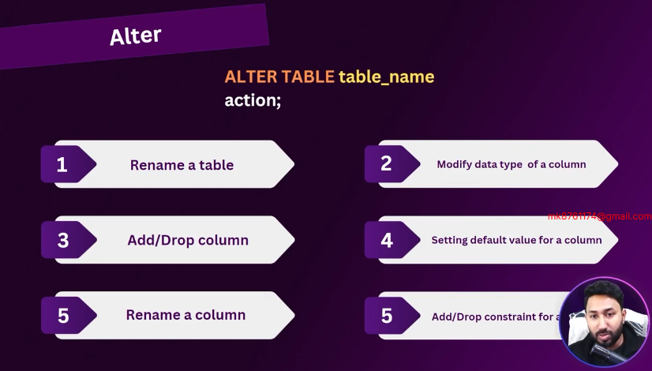
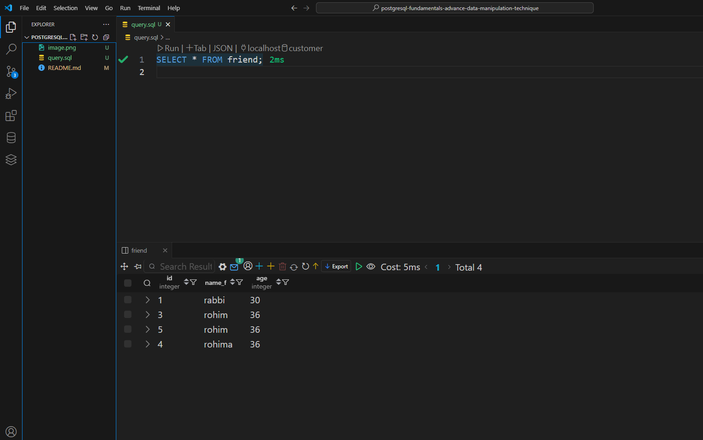
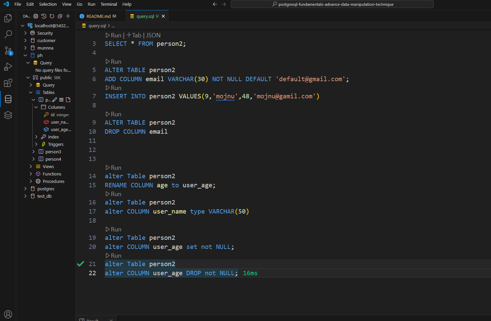
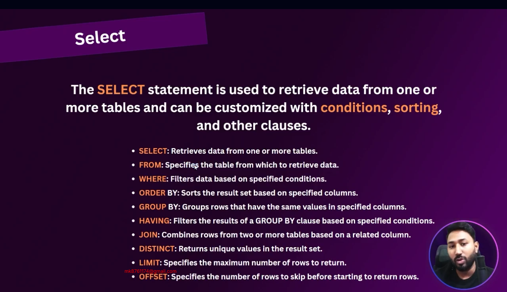

## PostgreSQL Fundamentals and Advance Data Manipulation Technique

## 8-1 Using the ALTER Keyword to Modify Tables and Setting Up PostgreSQL in VS Code\

- if you run your psql on vs code create a file like test.sql then query your code


## 8-2 Expanding on the ALTER Keyword for Table Modification

-- Active: 1747415487712@@localhost@5432@ph

- SELECT * FROM person2;

## Add column
ALTER TABLE person2
ADD COLUMN email VARCHAR(30) NOT NULL DEFAULT 'default@gmail.com';

## Insert in column
INSERT INTO person2 VALUES(9,'mojnu',48,'mojnu@gamil.com')
## Drop in column
ALTER TABLE person2
DROP COLUMN email


## Rename in column
alter Table person2
RENAME COLUMN age to user_age;

## Change type in column
alter Table person2
alter COLUMN user_name type VARCHAR(50)
## Set Constrain in column
alter Table person2
alter COLUMN user_age set not NULL;
## Drop in column
alter Table person2
alter COLUMN user_age DROP not NULL;

## 8-3 Different Methods to Alter Tables For Primary key, Unique etc
```sql
- add constraint and drop 
 alter Table person2
add constraint unique_person2_user_age UNIQUE(user_age) ; 
alter Table person2
drop constraint unique_person2_user_age ;  

```
- truncate if you want   all row  data deleted use truncate

## 8-4 Mastering SELECT Queries: Column Aliasing and Result Ordering in PostgreSQL

#### create table 
```sql 
CREATE Table students(
    student_id SERIAL PRIMARY KEY,
    first_name VARCHAR(50) NOT NULL,
    last_name VARCHAR(50)  NOT NULL,
    age INT  ,
    grade CHAR(2),
    course VARCHAR(50),
    email VARCHAR(50),
    dob DATE,
    blood_group VARCHAR(50),
    country VARCHAR(50)
);
```
### insert values in table 
```sql 
INSERT INTO students (
    first_name, last_name, age, grade, course, email, dob, blood_group, country
) VALUES
('Ali', 'Khan', 20, 'A', 'Mathematics', 'ali.khan1@example.com', '2005-02-15', 'A+', 'Bangladesh'),
('Sara', 'Ahmed', 21, 'B', 'Physics', 'sara.ahmed2@example.com', '2004-03-20', 'B+', 'Bangladesh'),
('Nabil', 'Hasan', 22, 'A', 'Biology', 'nabil.hasan3@example.com', '2003-05-10', 'O+', 'India'),
('Rita', 'Roy', 19, 'A+', 'Chemistry', 'rita.roy4@example.com', '2006-07-18', 'A-', 'Nepal'),
('Jamal', 'Uddin', 23, 'B+', 'English', 'jamal.uddin5@example.com', '2002-01-25', 'B-', 'Bangladesh'),
('Mira', 'Sultana', 18, 'A', 'Computer Science', 'mira.sultana6@example.com', '2007-10-30', 'O+', 'Pakistan'),
('Fahim', 'Rahman', 20, 'A-', 'Math', 'fahim.rahman7@example.com', '2005-12-12', 'AB+', 'Bangladesh'),
('Tania', 'Begum', 21, 'B', 'Statistics', 'tania.begum8@example.com', '2004-09-09', 'A+', 'India'),
('Rakib', 'Islam', 19, 'C', 'Physics', 'rakib.islam9@example.com', '2006-11-22', 'B+', 'Nepal'),
('Shila', 'Das', 20, 'A+', 'Zoology', 'shila.das10@example.com', '2005-08-03', 'O-', 'Bangladesh'),
('Hasan', 'Ali', 22, 'B-', 'Philosophy', 'hasan.ali11@example.com', '2003-06-14', 'A+', 'India'),
('Nusrat', 'Jahan', 20, 'A', 'Geography', 'nusrat.jahan12@example.com', '2005-04-07', 'B+', 'Bangladesh'),
('Tanvir', 'Hossain', 21, 'B+', 'Math', 'tanvir.hossain13@example.com', '2004-07-29', 'O+', 'Bangladesh'),
('Sadia', 'Khatun', 20, 'C+', 'Physics', 'sadia.khatun14@example.com', '2005-02-10', 'A-', 'Nepal'),
('Rafi', 'Ahmed', 23, 'A-', 'Chemistry', 'rafi.ahmed15@example.com', '2002-11-19', 'AB+', 'Bangladesh'),
('Mahi', 'Rana', 19, 'B', 'Computer Science', 'mahi.rana16@example.com', '2006-03-13', 'O+', 'India'),
('Jui', 'Akter', 18, 'A+', 'Statistics', 'jui.akter17@example.com', '2007-01-01', 'A-', 'Pakistan'),
('Reza', 'Karim', 21, 'B+', 'Zoology', 'reza.karim18@example.com', '2004-06-16', 'B-', 'Bangladesh'),
('Sajid', 'Ullah', 20, 'A', 'Math', 'sajid.ullah19@example.com', '2005-05-23', 'O+', 'Bangladesh'),
('Nila', 'Parvin', 22, 'A+', 'English', 'nila.parvin20@example.com', '2003-12-08', 'A+', 'Nepal');

```
``` sql
- select one column 
SELECT age FROM students;
```
``` sql
- select multiple column one column 
SELECT age,email,first_name FROM students;
```
``` sql
- select change any columns column name- 
SELECT email as "Student Email",age as "Student Age" FROM students;
```
``` sql
- sorting in desc- 
SELECT * FROM students ORDER BY age DESC;
```
``` sql
- sorting in desc- 
SELECT * FROM students ORDER BY age ASC;
```