## PostgreSQL Fundamentals and Advance Data Manipulation Technique

## 8-1 Using the ALTER Keyword to Modify Tables and Setting Up PostgreSQL in VS Code\

- if you run your psql on vs code create a file like test.sql then query your code


## 8-2 Expanding on the ALTER Keyword for Table Modification

-- Active: 1747415487712@@localhost@5432@ph

- SELECT * FROM person2;

## Add column
ALTER TABLE person2
ADD COLUMN email VARCHAR(30) NOT NULL DEFAULT 'default@gmail.com';

## Insert in column
INSERT INTO person2 VALUES(9,'mojnu',48,'mojnu@gamil.com')
## Drop in column
ALTER TABLE person2
DROP COLUMN email


## Rename in column
alter Table person2
RENAME COLUMN age to user_age;

## Change type in column
alter Table person2
alter COLUMN user_name type VARCHAR(50)
## Set Constrain in column
alter Table person2
alter COLUMN user_age set not NULL;
## Drop in column
alter Table person2
alter COLUMN user_age DROP not NULL;

## 8-3 Different Methods to Alter Tables For Primary key, Unique etc
```sql
- add constraint and drop 
 alter Table person2
add constraint unique_person2_user_age UNIQUE(user_age) ; 
alter Table person2
drop constraint unique_person2_user_age ;  
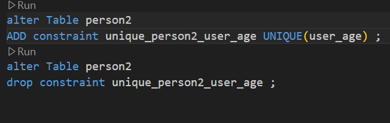
```
- truncate if you want   all row  data deleted use truncate

## 8-4 Mastering SELECT Queries: Column Aliasing and Result Ordering in PostgreSQL

#### create table 
```sql 
CREATE Table students(
    student_id SERIAL PRIMARY KEY,
    first_name VARCHAR(50) NOT NULL,
    last_name VARCHAR(50)  NOT NULL,
    age INT  ,
    grade CHAR(2),
    course VARCHAR(50),
    email VARCHAR(50),
    dob DATE,
    blood_group VARCHAR(50),
    country VARCHAR(50)
);
```
### insert values in table 
```sql 
INSERT INTO students (
    first_name, last_name, age, grade, course, email, dob, blood_group, country
) VALUES
('Ali', 'Khan', 20, 'A', 'Mathematics', 'ali.khan1@example.com', '2005-02-15', 'A+', 'Bangladesh'),
('Sara', 'Ahmed', 21, 'B', 'Physics', 'sara.ahmed2@example.com', '2004-03-20', 'B+', 'Bangladesh'),
('Nabil', 'Hasan', 22, 'A', 'Biology', 'nabil.hasan3@example.com', '2003-05-10', 'O+', 'India'),
('Rita', 'Roy', 19, 'A+', 'Chemistry', 'rita.roy4@example.com', '2006-07-18', 'A-', 'Nepal'),
('Jamal', 'Uddin', 23, 'B+', 'English', 'jamal.uddin5@example.com', '2002-01-25', 'B-', 'Bangladesh'),
('Mira', 'Sultana', 18, 'A', 'Computer Science', 'mira.sultana6@example.com', '2007-10-30', 'O+', 'Pakistan'),
('Fahim', 'Rahman', 20, 'A-', 'Math', 'fahim.rahman7@example.com', '2005-12-12', 'AB+', 'Bangladesh'),
('Tania', 'Begum', 21, 'B', 'Statistics', 'tania.begum8@example.com', '2004-09-09', 'A+', 'India'),
('Rakib', 'Islam', 19, 'C', 'Physics', 'rakib.islam9@example.com', '2006-11-22', 'B+', 'Nepal'),
('Shila', 'Das', 20, 'A+', 'Zoology', 'shila.das10@example.com', '2005-08-03', 'O-', 'Bangladesh'),
('Hasan', 'Ali', 22, 'B-', 'Philosophy', 'hasan.ali11@example.com', '2003-06-14', 'A+', 'India'),
('Nusrat', 'Jahan', 20, 'A', 'Geography', 'nusrat.jahan12@example.com', '2005-04-07', 'B+', 'Bangladesh'),
('Tanvir', 'Hossain', 21, 'B+', 'Math', 'tanvir.hossain13@example.com', '2004-07-29', 'O+', 'Bangladesh'),
('Sadia', 'Khatun', 20, 'C+', 'Physics', 'sadia.khatun14@example.com', '2005-02-10', 'A-', 'Nepal'),
('Rafi', 'Ahmed', 23, 'A-', 'Chemistry', 'rafi.ahmed15@example.com', '2002-11-19', 'AB+', 'Bangladesh'),
('Mahi', 'Rana', 19, 'B', 'Computer Science', 'mahi.rana16@example.com', '2006-03-13', 'O+', 'India'),
('Jui', 'Akter', 18, 'A+', 'Statistics', 'jui.akter17@example.com', '2007-01-01', 'A-', 'Pakistan'),
('Reza', 'Karim', 21, 'B+', 'Zoology', 'reza.karim18@example.com', '2004-06-16', 'B-', 'Bangladesh'),
('Sajid', 'Ullah', 20, 'A', 'Math', 'sajid.ullah19@example.com', '2005-05-23', 'O+', 'Bangladesh'),
('Nila', 'Parvin', 22, 'A+', 'English', 'nila.parvin20@example.com', '2003-12-08', 'A+', 'Nepal');

```
``` sql
- select one column 
SELECT age FROM students;
```
``` sql
- select multiple column one column 
SELECT age,email,first_name FROM students;
```
``` sql
- select change any columns column name- 
SELECT email as "Student Email",age as "Student Age" FROM students;
```
``` sql
- sorting in desc- 
SELECT * FROM students ORDER BY age DESC;
```
``` sql
- sorting in desc- 
SELECT * FROM students ORDER BY age ASC;
```


## 8-5 Data Filtering: WHERE Clause, Logical Operators, and Comparison Operators
- Distinct check unique country 
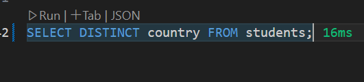
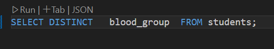

-- country base filtering
``` sql
SELECT * FROM students
WHERE country='India';
```
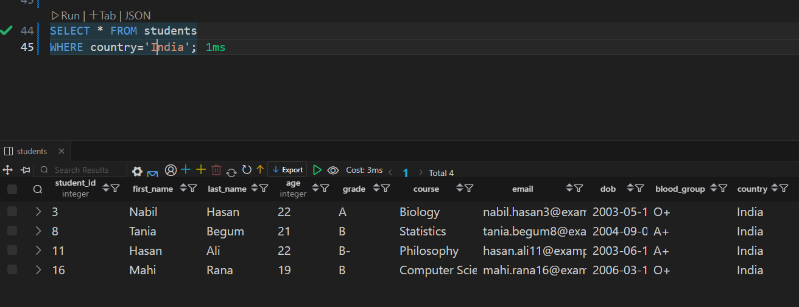

```sql
-- select students with B grade in physics
SELECT * FROM students
WHERE grade='B' AND course = 'Physics';
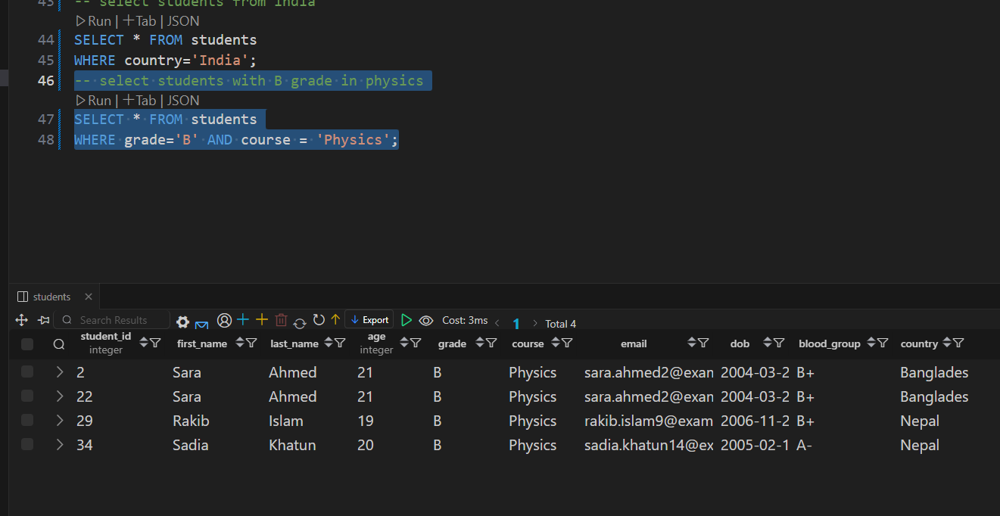
```
```sql
-- select student from nepal or india
SELECT * FROM students
WHERE country='Nepal' OR country='India';
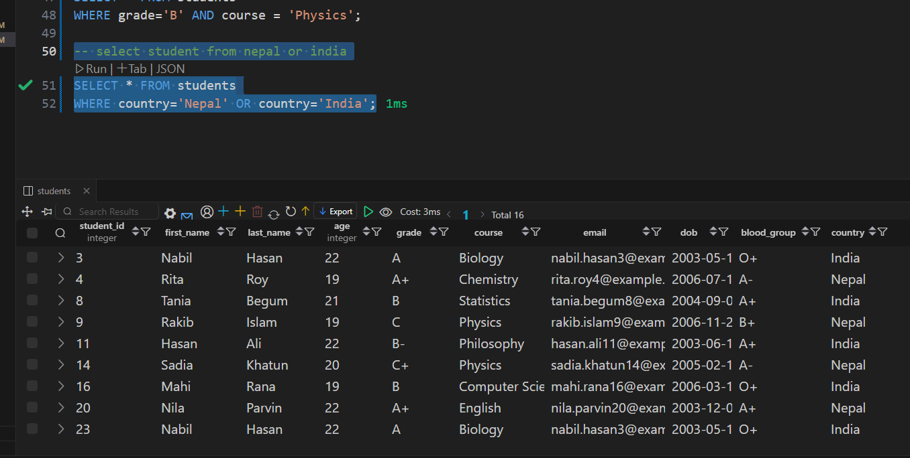
```
```sql
-- select student from nepal or india and age 22
SELECT * FROM students
WHERE( country='Nepal' OR country='India') AND age=22;
```
```sql
-- select student from   age 22
SELECT * FROM students
WHERE age >=22;
```
```sql
-- select student from   != Nepal not =
SELECT * FROM students
WHERE country != 'Nepal';
SELECT * FROM students
WHERE country <> 'Nepal';
```
## 8-6 Exploring Scalar and Aggregate Functions in PostgreSQL
column uppercase and lowercase
```sql
SELECT upper(first_name)FROM students;
SELECT lower (last_name)FROM students;
```
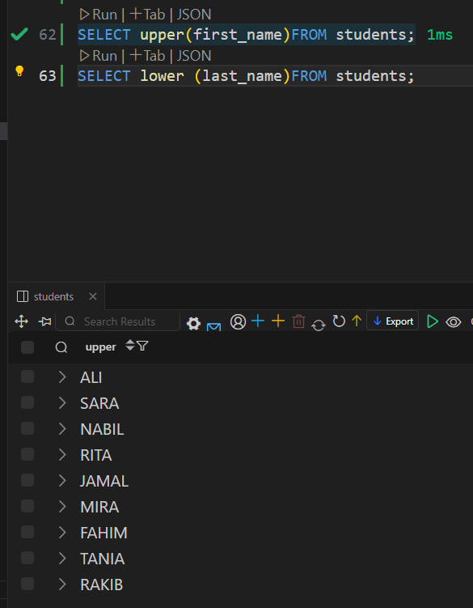
-  concat
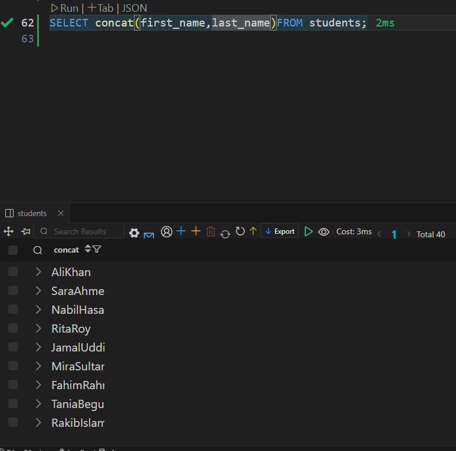
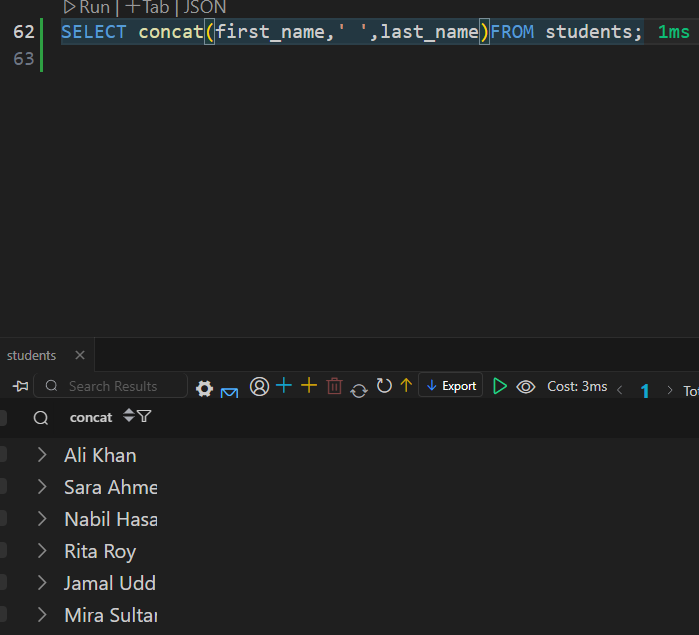
## scaler function
A Scalar Function in SQL is a function that takes one or more inputs and returns a single (scalar) value. It operates on each row individually and returns one value per row.

🔹 String Functions

| Function                        | Description                                | Example                             |
| ------------------------------- | ------------------------------------------ | ----------------------------------- |
| `UPPER(str)`                    | Converts string to uppercase               | `UPPER('munna') → 'MUNNA'`          |
| `LOWER(str)`                    | Converts string to lowercase               | `LOWER('MUNNA') → 'munna'`          |
| `LEN(str)` / `LENGTH(str)`      | Returns the length of the string           | `LEN('Hello') → 5`                  |
| `SUBSTRING(str, start, length)` | Extracts part of a string                  | `SUBSTRING('abcdef', 2, 3) → 'bcd'` |
| `TRIM(str)`                     | Removes leading and trailing spaces        | `TRIM('  Munna  ') → 'Munna'`       |
| `REPLACE(str, from, to)`        | Replaces part of string with another value | `REPLACE('abc', 'a', 'z') → 'zbc'`  |


🔹 Numeric Functions
| Function      | Description                       | Example                    |
| ------------- | --------------------------------- | -------------------------- |
| `ABS(x)`      | Returns absolute value            | `ABS(-10) → 10`            |
| `CEILING(x)`  | Rounds up to nearest integer      | `CEILING(4.2) → 5`         |
| `FLOOR(x)`    | Rounds down to nearest integer    | `FLOOR(4.8) → 4`           |
| `ROUND(x, d)` | Rounds number to d decimal places | `ROUND(3.14159, 2) → 3.14` |
| `POWER(x, y)` | Raises x to the power of y        | `POWER(2, 3) → 8`          |
| `SQRT(x)`     | Returns square root               | `SQRT(25) → 5` 
            |
🔹 Date/Time Functions
| Function               | Description                                | Example                               |
| ---------------------- | ------------------------------------------ | ------------------------------------- |
| `GETDATE()` / `NOW()`  | Returns current date and time              | `GETDATE() → 2025-05-18 12:30:00`     |
| `DATEPART(part, date)` | Returns part of a date (year, month, etc.) | `DATEPART(YEAR, '2025-05-18') → 2025` |
| `DAY(date)`            | Extracts day from date                     | `DAY('2025-05-18') → 18`              |
| `MONTH(date)`          | Extracts month                             | `MONTH('2025-05-18') → 5`             |
| `YEAR(date)`           | Extracts year                              | `YEAR('2025-05-18') → 2025`           |


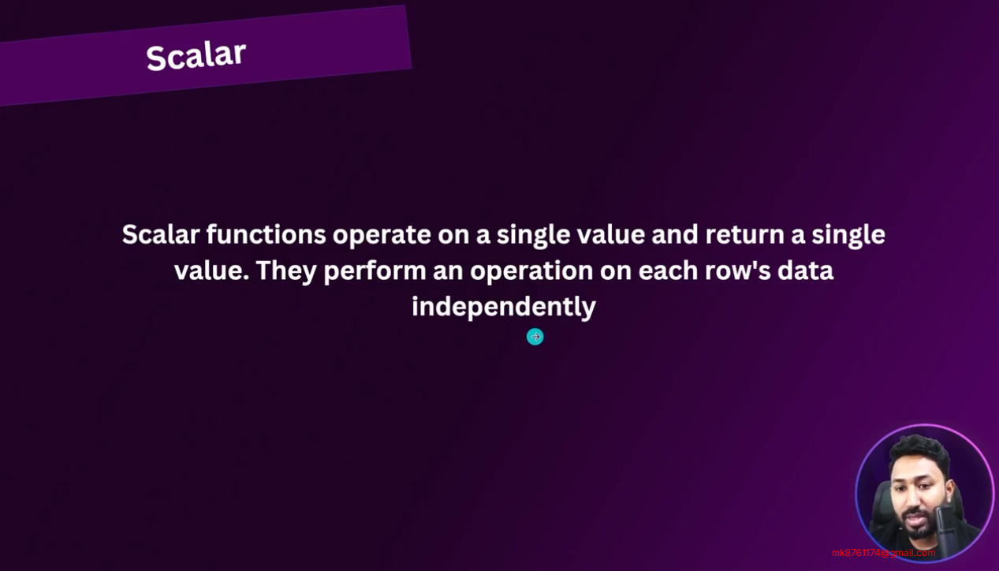
## aggregate function
What is an Aggregate Function?
An Aggregate Function in SQL performs a calculation on a set of values and returns a single summary value. Unlike scalar functions (which work row by row), aggregate functions work on groups of rows — often used with GROUP BY.
| Function  | Description             | Example       |
| --------- | ----------------------- | ------------- |
| `COUNT()` | Counts rows             | `COUNT(*)`    |
| `SUM()`   | Adds up numeric values  | `SUM(salary)` |
| `AVG()`   | Calculates average      | `AVG(price)`  |
| `MAX()`   | Finds the maximum value | `MAX(age)`    |
| `MIN()`   | Finds the minimum value | `MIN(score)`  |

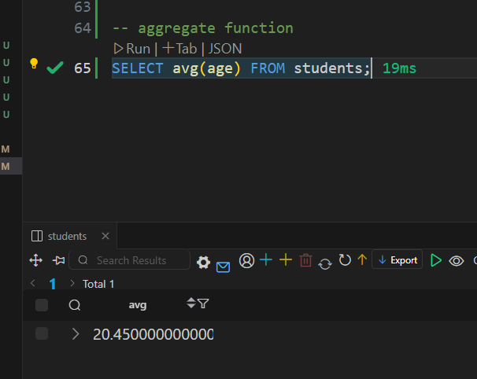
## 8-7 Logical Negation NOT, understanding NULL and the Null-Coalescing Operator in PostgreSQL
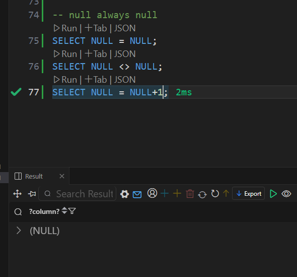
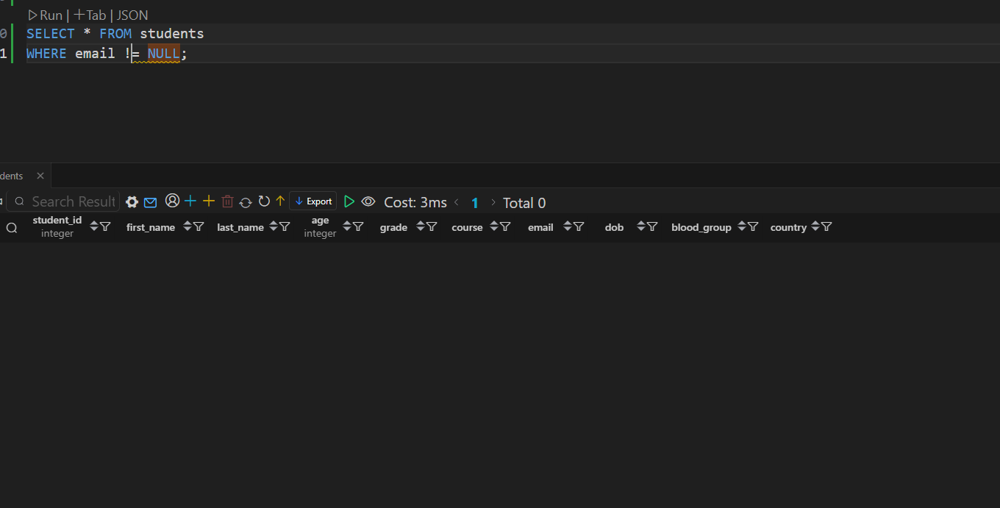

## 🔍 What does COALESCE() do?
The COALESCE() function returns the first non-null value from the list of values provided.

📌 In Your Query:
You're selecting the email column from the students table.

If the email is NOT NULL, it will return the actual email.

If the email is NULL, it will return 'Email not Provided' instead.
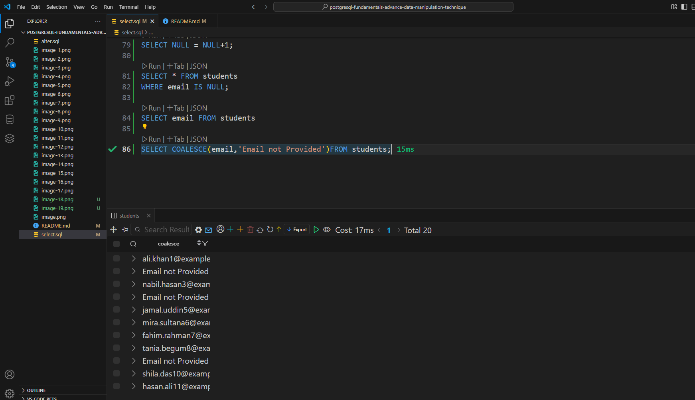